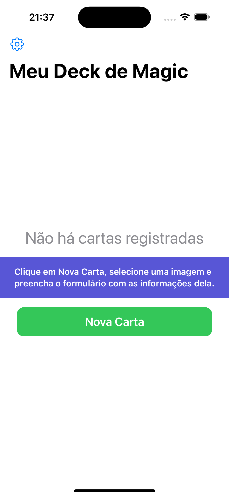
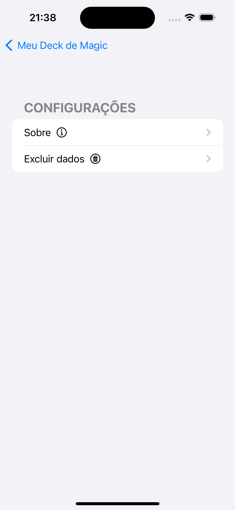
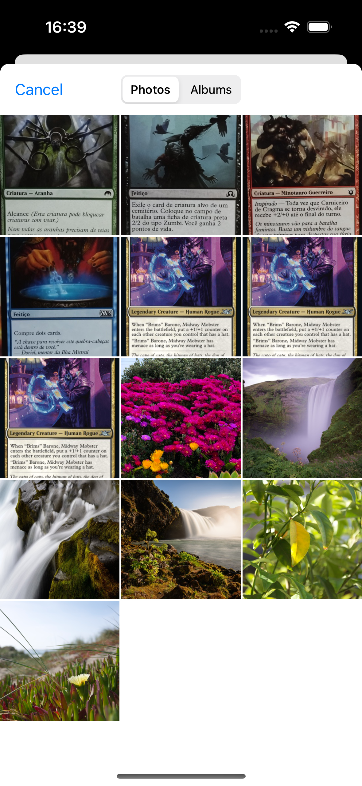
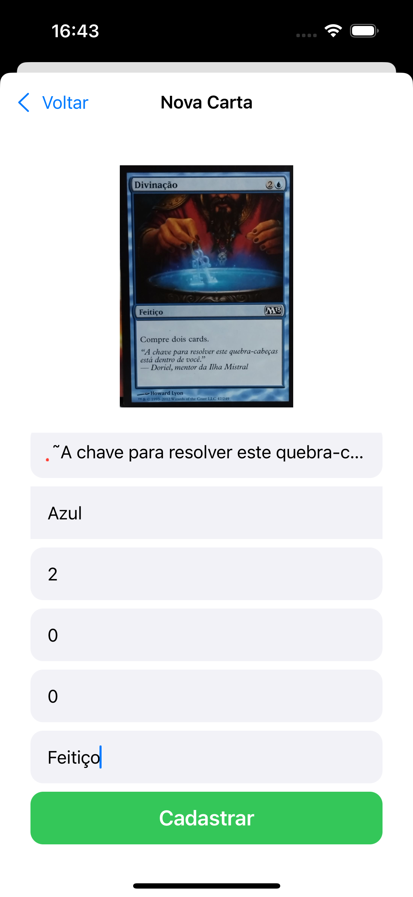

# Magic-Cards-Crud
Projeto do curso de Pós Gradução da PUCPR - Desenvolvimento de Aplicativos Móveis: Desenvolvimento de Aplicativos iOS

## Descrição:
A aplicação desenvolvida para IOS atende na finalidade de fazer o cadastro de cartas do jog Magic: The Gathering.

## Motivo da aplicação:
O jogo de cartas Magic: The Gathering é bastante popular mundo a fora e possui bastante jogadores aqui no Brasil. Entretanto, os jogadores que desejam realizar o cadastro de suas carta,
montar o seu próprio deck(Grimório) ficam apenas presos ao formato físico das cartas, ou seja, apenas com as cartas em mãos. A finalidade dessa aplicação nada mais é do que, realizar o cadastramento das suas cartas de Magic e
mostrar para outros jogadores, podendo assim até mesmo realizar trocas de cartas, informações e estratégias de jogo.

## Informações Técnicas:
A aplicação foi desenvolvida com a linguagem Swift, para construção da interface da aplicação SwiftUI e para a persistência de dados utilizou -se Core Data.

## Tecnologias usadas:
- Swift: https://docs.swift.org/swift-book/documentation/the-swift-programming-language/
- SwiftUI: https://developer.apple.com/tutorials/swiftui
- Core Data: https://developer.apple.com/documentation/coredata/

## Imagens:

### Próximos passos:
- Inserir campo de pesquisa de cards.
- Opção para mudar tema de cores do aplicativo.

### Autor:
- Alfredo Paes da Luz.
